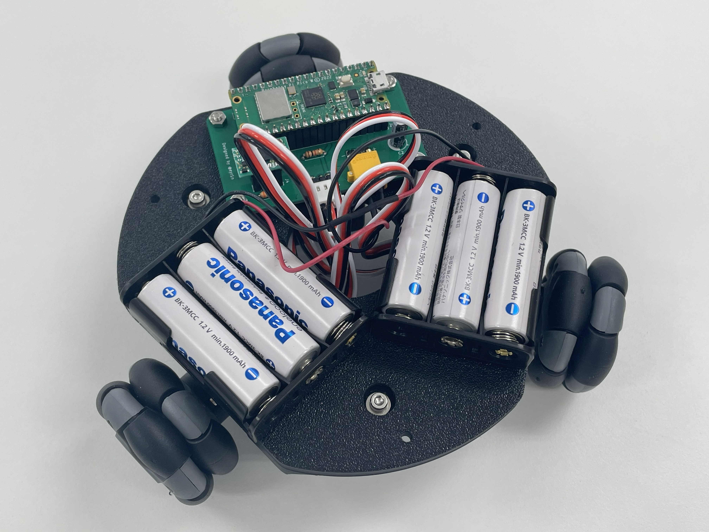
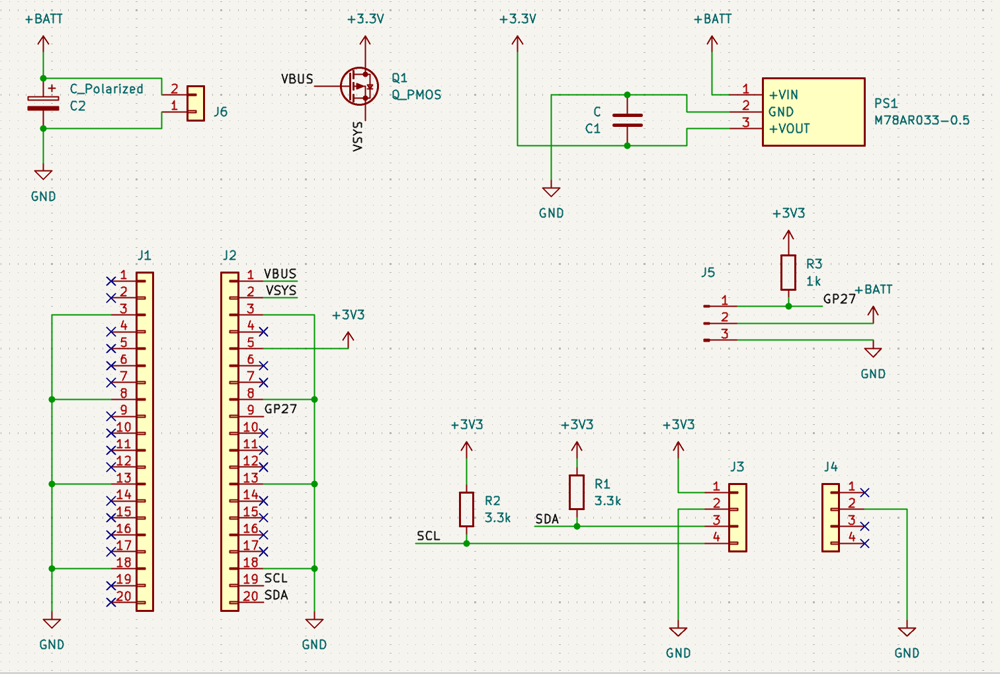

# PicomniRover サポートリポジトリ

## 目次

- [これは何？](#これは何)
- [購入するものリスト](#購入するものリスト)
  - [秋月電子通商で購入可能なもの](#秋月電子通商で購入可能なもの)
  - [ロボットショップで購入可能なもの](#ロボットショップで購入可能なもの)
  - [モノタロウで購入可能なもの](#モノタロウで購入可能なもの)
- [3Dプリント部品について](#3dプリント部品について)
- [基板について](#基板について)
- [ライセンス](#ライセンス)

## これは何？

本リポジトリは、コミックマーケット107にて頒布した「やる気出ないんズ 活動報告書 vol.1」内の「かんたん！全方位移動ロボットのつくりかた」にて製作する全方位移動ロボット「PicomniRover」に関する情報をまとめたリポジトリです。

## 購入するものリスト

ここでは、購入する必要のある市販の部品についてまとめます。私が使用した購入先は以下の3つです。

- [秋月電子通商 - https://akizukidenshi.com/](https://akizukidenshi.com/)
- [ロボットショップ(ヴイストン) - https://www.vstone.co.jp/robotshop/](https://www.vstone.co.jp/robotshop/)
- [モノタロウ - https://www.monotaro.com/](https://www.monotaro.com/)

すべてオンライン購入を前提に記載していますが、ねじ類などは近所のホームセンターでも代替可能です。必要に応じて入手しやすい手段を選んでいただければと思います。

また、同人誌内で製作するロボットの動作には、単3形の充電式ニッケル水素電池(公称1.2V)が6本必要です。Panasonic製eneloopやSony製CycleEnergyなど、単3形で公称電圧1.2Vの充電式ニッケル水素電池を用意してください。1.5Vのアルカリ乾電池は使用しないでください。

### 秋月電子通商で購入可能なもの

| 商品名 | 数量(使用数) | 単価(購入単位) | 購入リンク |
| --- | --- | --- | --- |
| Raspberry Pi Pico W | 1個 | ¥1,200 | [リンク](https://akizukidenshi.com/catalog/g/g117947) | 
| BNO055使用 9軸センサーフュージョンモジュールキット/AE-BNO055-BO | 1個 | ¥2,450 | [リンク](https://akizukidenshi.com/catalog/g/g116996) | 
| FEETECHシリアルバスサーボ STS3215 7.4V 14.4kg・cm 1:147 | 3個 | ¥2,780 | [リンク](https://akizukidenshi.com/catalog/g/g131132) | 
| 超高効率DCDCコンバーター(3.3V 0.5A) M78AR033-0.5 | 1個 | ¥380 | [リンク](https://akizukidenshi.com/catalog/g/g107178) | 
| 電池ボックス 単3×3本 リード線/BH-331-3A | 2個 | ¥70 | [リンク](https://akizukidenshi.com/catalog/g/g102667) | 
| XT30コネクター オス 基板取付用 XT30PW-M | 1個 | ¥70 | [リンク](https://akizukidenshi.com/catalog/g/g117949) | 
| XT30コネクター メス XT30U-F | 1個 | ¥50 | [リンク](https://akizukidenshi.com/catalog/g/g117950) | 
| Pch MOSFET 2SJ496TZ-E (60V 5A) | 1個 | ¥90 | [リンク](https://akizukidenshi.com/catalog/g/g109040) | 
| 電解コンデンサー 100μF 25V 105℃ ルビコンPX/25PX100MEFC5X11 | 1個 | ¥10 | [リンク](https://akizukidenshi.com/catalog/g/g117877) | 
| 積層セラミックコンデンサー 3.3μF 50V X7R 5mm/RDER71H335K3K1H03B | 1個 | ¥50 | [リンク](https://akizukidenshi.com/catalog/g/g108153) | 
| カーボン抵抗(炭素皮膜抵抗) 1/4W 1kΩ/CF25J1KB | 1本 (100本/袋) | ¥100 | [リンク](https://akizukidenshi.com/catalog/g/g125102) | 
| カーボン抵抗(炭素皮膜抵抗) 1/4W 3.3kΩ/CF25J3K3B | 2本 (100本/袋) | ¥140 | [リンク](https://akizukidenshi.com/catalog/g/g125332) | 
| ピンヘッダー 1×40 (40P)/PH-1x40SG | 2個 | ¥35 | [リンク](https://akizukidenshi.com/catalog/g/g100167) | 
| ピンヘッダー (L型) 1×6 (6P)/PH-1X6RG(2) | 1個 | ¥10 | [リンク](https://akizukidenshi.com/catalog/g/g105336) | 
| 分割ロングピンソケット 1×42 (42P)/FHU-1x42SG | 2個 | ¥80 | [リンク](https://akizukidenshi.com/catalog/g/g105779) | 
| 合計 |  | ¥13,260 |  | 

### ロボットショップで購入可能なもの

| 商品名 | 数量(使用数) | 単価(購入単位) | 購入リンク |
| --- | --- | --- | --- |
| 48mmオムニホイール(六角ハブ対応)(14038) | 3個 | ¥715 | [リンク](https://www.vstone.co.jp/robotshop/index.php?main_page=product_info&products_id=5180) | 
| 合計 |  | ¥2,145 |  | 

### モノタロウで購入可能なもの

| 商品名 | 数量(使用数) | 単価(購入単位) | 購入リンク |
| --- | --- | --- | --- |
| 六角穴付ボルト(ステンレス) 全ねじ M3×10mm | 6個 | ¥681 (55個/袋) | [リンク](https://www.monotaro.com/p/2901/7714/) | 
| 六角穴付ボルト(ステンレス) 全ねじ M3×12mm | 4個 | ¥802 (54個/袋) | [リンク](https://www.monotaro.com/p/2901/7723/) | 
| 六角穴付ボルト(ステンレス) 全ねじ M3×30mm | 3個 | ¥659 (25個/袋) | [リンク](https://www.monotaro.com/p/6891/0652/) | 
| 六角ナット1種 ステンレス M3 | 14個 | ¥175 (50個/袋) | [リンク](https://www.monotaro.com/p/2876/3448/) | 
| 平ワッシャー ステンレス M3×8×0.5 | 6個 | ¥99 (50個/袋) | [リンク](https://www.monotaro.com/p/2876/4114/) | 
| 合計 |  | ¥2,416 |  | 

## 3Dプリント部品について

ここでは、3Dプリンターで印刷する必要のある部品についてまとめます。ここで紹介する部品は、C107にて頒布した「ロボット部品セット」を購入した場合、印刷不要です。

印刷に使用した環境は以下の通りです。

- プリンター: Bambu Lab A1 mini
- ノズル径: 0.4mm
- プリセット: 0.20mm Standard @BBL A1M
- フィラメント: eSUN PLA+

| 部品名 | STEPファイル | 数量 | 備考 |
| --- | --- | --- | --- |
| ボディー | [STEP/body.step](STEP/body.step) | 1個 | 1層目のみ30mm/sで印刷 | 
| モーター固定具 | [STEP/motor_bracket.step](STEP/motor_bracket.step) | 3個 |  | 
| ホイール固定具1 | [STEP/wheel_mount1.step](STEP/wheel_mount1.step) | 3個 |  | 
| ホイール固定具2 | [STEP/wheel_mount2.step](STEP/wheel_mount2.step) | 3個 |  | 
| 基板スペーサー | [STEP/pcb_spacer.step](STEP/pcb_spacer.step) | 4個 |  | 

## 基板について

同人誌内で使用するシールド基板は KiCad 9.0.6 で設計し、JLCPCB に製造を発注しました。

プロジェクトファイル一式は [KiCad/PicomniRover](KiCad/PicomniRover) (`PicomniRover.kicad_pro` / `.kicad_pcb` / `.kicad_sch`) にあり、製造用ガーバーデータは [KiCad/PicomniRover/jlcpcb/production_files/GERBER-PicomniRover.zip](KiCad/PicomniRover/jlcpcb/production_files/GERBER-PicomniRover.zip) にまとめています。

回路図は以下の通りです。

## ライセンス

MIT ライセンス
